# __Deployment of Python Application with Proxy Server__
## Introduction
This project serves as a step-by-step guide for deploying a Python application in a production environment with a proxy server.
It explains how to set up the server, configure the application, install dependencies, and integrate a proxy (such as Nginx) to manage and route incoming traffic efficiently.
By following this deployment process, you can ensure better performance, scalability, and security for your Python-based application.

## Features
* Production-Ready – Runs smoothly in production

* Secure & Efficient – Proxy integration improves performance and security

* Environment Management – Supports virtual environments

## Prerequisites
* Python 3.x – Required to run the application.

* Pip – To install dependencies.

* Git (optional) – For cloning the repository.

* Virtual Environment (venv) – Recommended for isolated setups.

* Proxy Server (Nginx/Apache) – For handling and routing requests in production.

Deployment Steps

Step 1: Launch an EC2 Instance
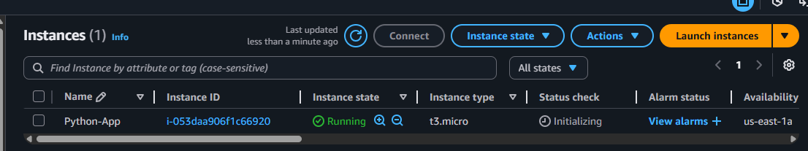

Step 2: Copy SSH Command and Paste Command in Git bash

Step 3: Update Packages and Install Python3 and pip

  #Update 
      
      sudo yum update
  #Install python3  

      sudo yum install python3 -y 
  #Install pip

       sudo yum install python3-pip

          
Step 4: Upload / Clone Your 
Application

1.Install git

       sudo yum install git -y

     
2. Clone the Application and go inside the pythonapp folder

        # Clone git application
        git clone <git url> 
        # Go inside pythonapp folder
        cd pythonapp/

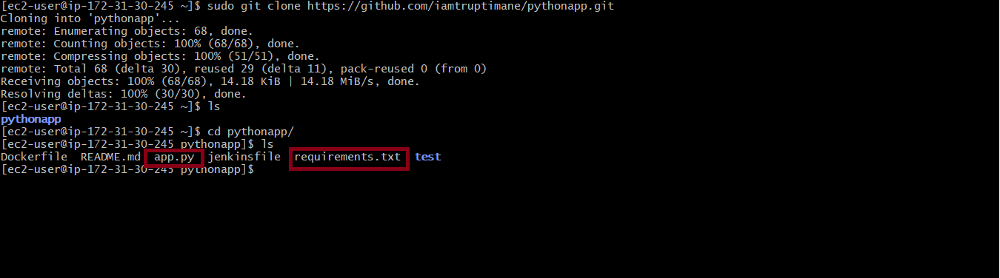 

Step 5: Create and Activate Virtual Environment
    
      # Create virtual environment
      sudo python3 -m venv myenv
      # Activate file 
      sudo bash myenv/bin/activate
 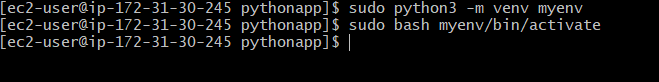
Step 6: Install Dependency

     sudo pip install -r requirement.txt  
  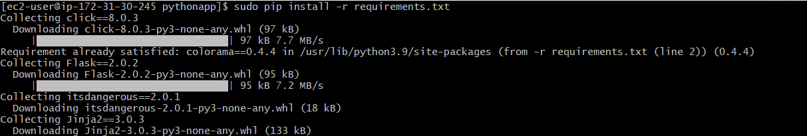   
Step 7: Run the Application at Background

    gunicorn --bind 0.0.0.0:5000 app:app --daemon
 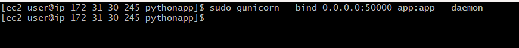   

 Step 8: Create a Proxy Server
 
 1. Configure Nginx a Proxy
  
        sudo yum install nginx -y
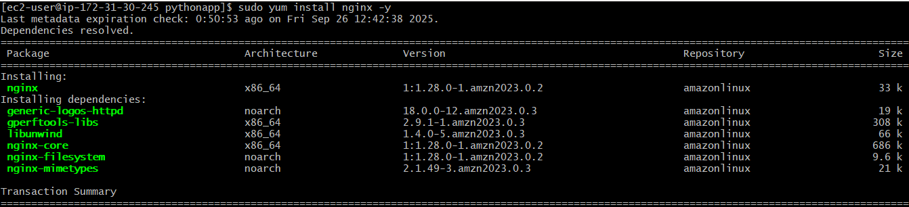 
2. Create Server block for your app

* Open nginx.conf file

      cd/etc/nginx
      sudo vim nginx.conf
 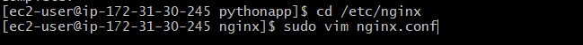     

 3. Edit Server Block

 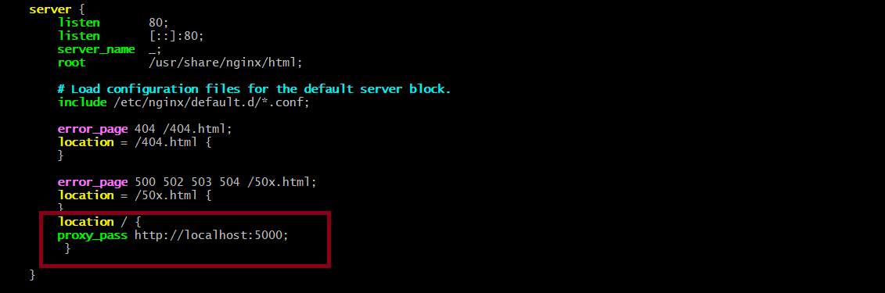

 4. Restart Nginx
  
        sudo systemctl restart nginx
 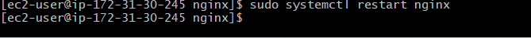  

 5. Allow Port 5000 (to access the python app) in Security Group(AWS EC2) 

  Go to EC2 -> Security Groups -> Edit Inbound Rules

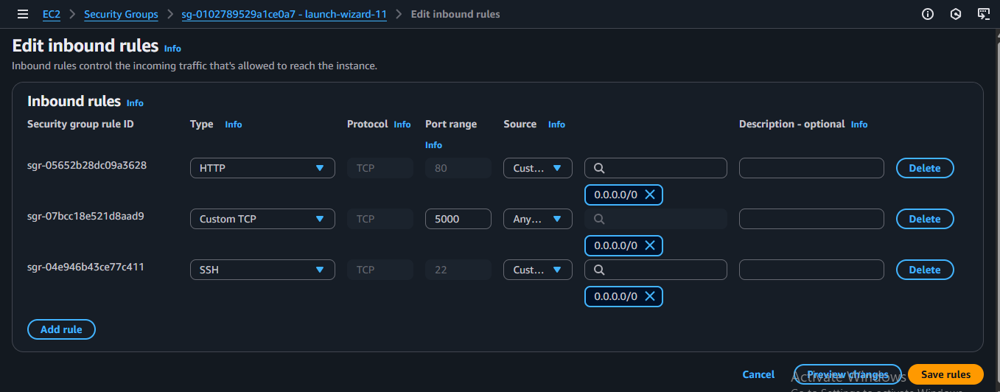

 Step 9: Test the Deployment

  Copy the public IP of your EC2/Server and paste in into any browser
  
  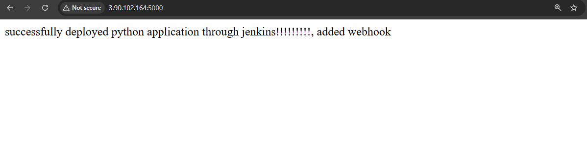

  ### Summary:
  This project explains how to deploy a Python application in a production environment, including setting up the environment, installing dependency,configuring the app, and using Nginx as a proxy for efficient traffic management.

